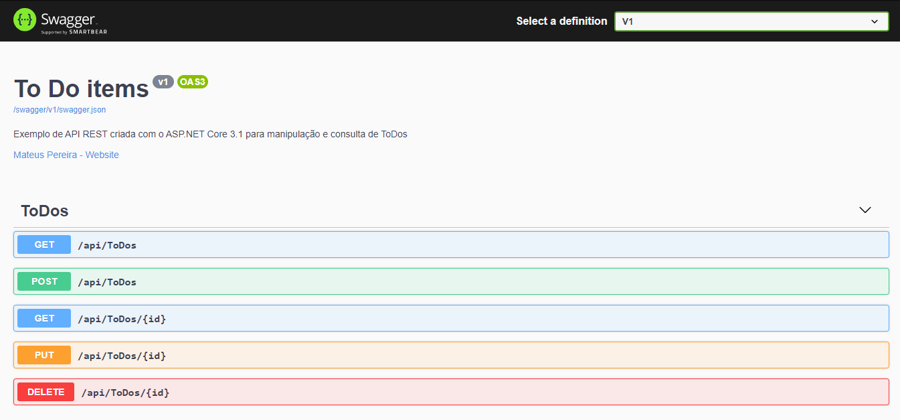
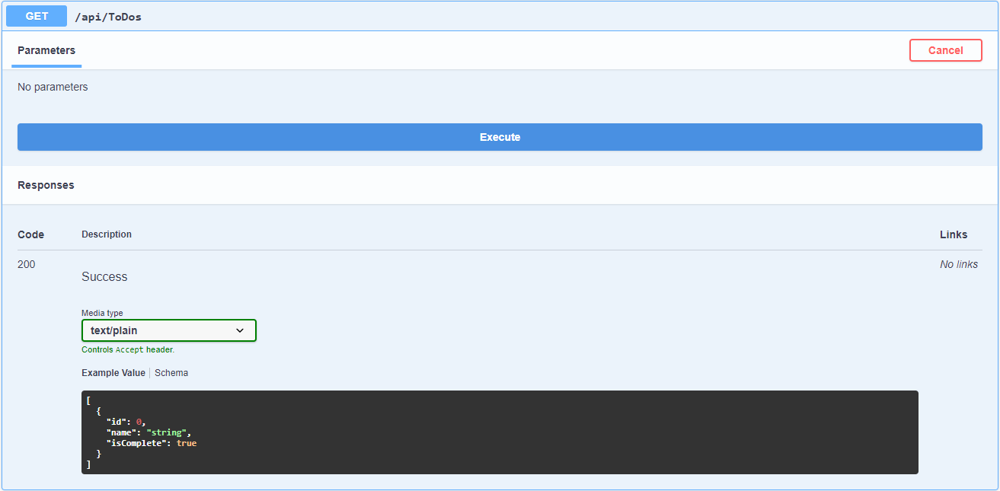
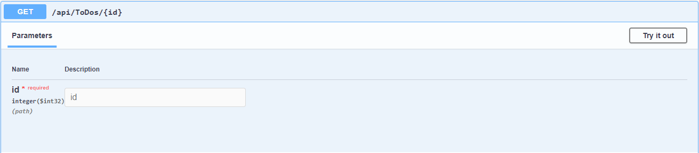
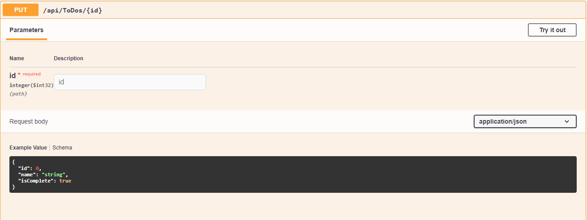
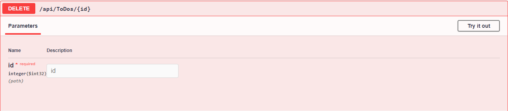

<h1>ApiSwagger</h1>
<h3>Documentação de uma api de ToDos com Swagger</h3>
   
<h2>Swagger UI</h2>

  
<h2>Get</h2>

  
<h2>Get por Id</h2>

  
<h2>Post</h2>

  
<h2>Put</h2>

  
<h2>Delete</h2>

